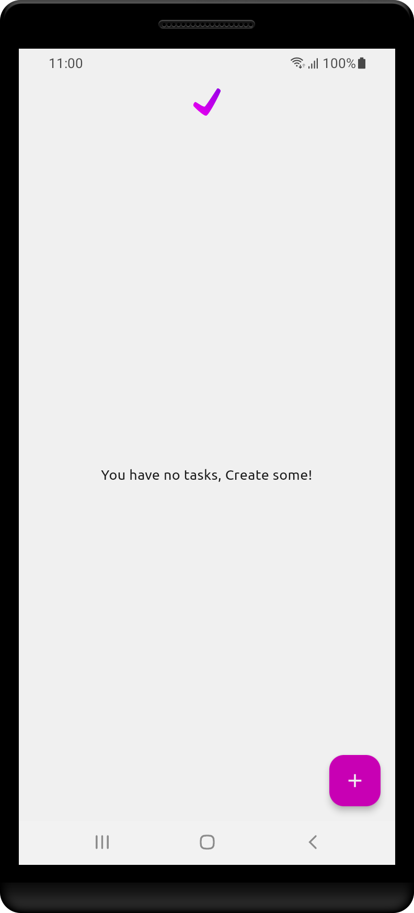
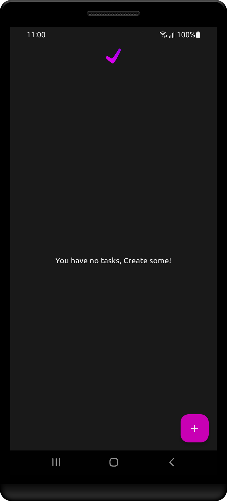
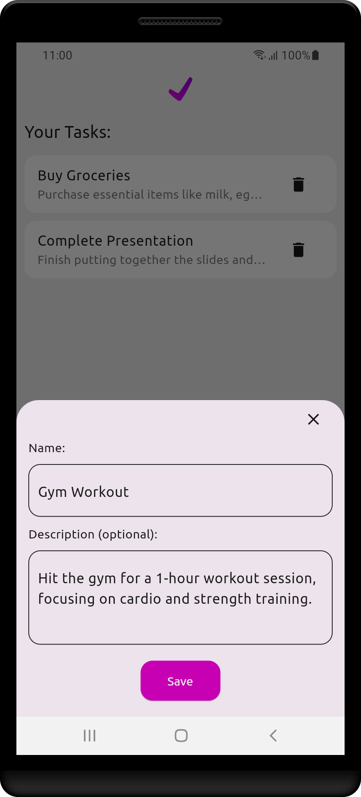
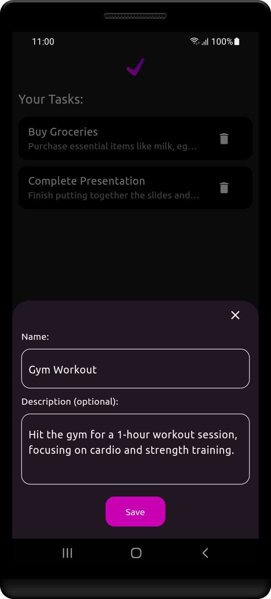
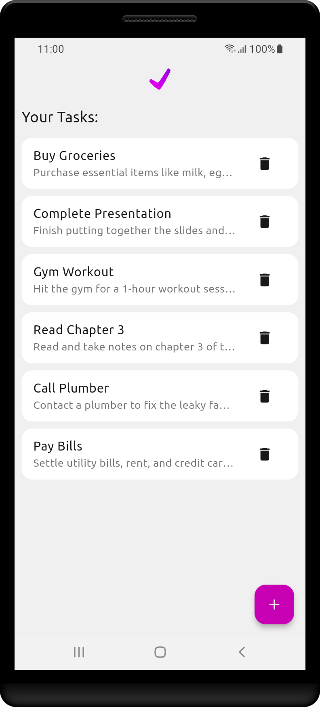
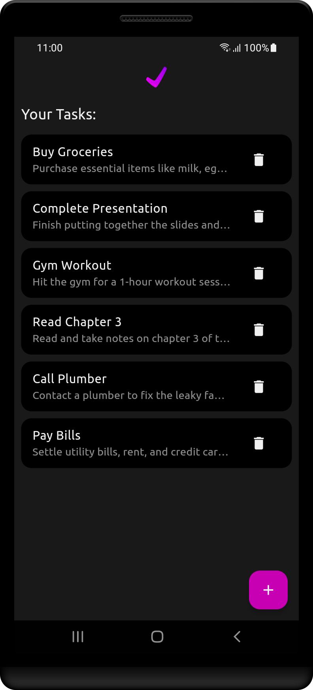
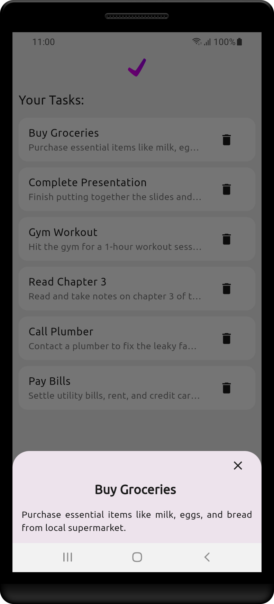
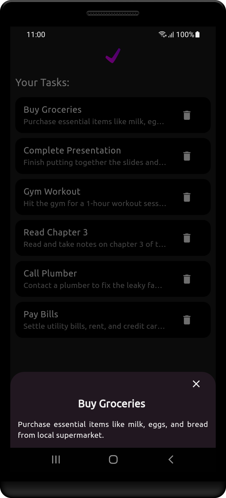

# TaskHub - Streamlined Task Management App

  

Meet TaskHub – your ultimate task manager app developed using Google's Flutter technology. Created as a passion project, TaskHub is your organizational partner, making your life smoother.

Adding tasks is a breeze in TaskHub. Just enter the task name and details, and you're set. No limits – add as many tasks as needed.

Delve into task details with a tap. See what each task requires, ensuring you tackle them with focus.

Lose the worry of task loss – TaskHub stores everything on your device. Close the app, return later, and your tasks are there.

TaskHub simplifies task management, your way. Let it be your pocket assistant, aiding organization and task completion

## Features

- **MVVM Clean Architecture**: This project has been developed following the mvvm clean architecture pattern. This allows this app to be easily scaleable.

- **Effortless Task Input**: Seamlessly capture your tasks by entering task names and descriptions with ease. Task creation has never been smoother.

- **Unlimited Task Entries**: TaskHub doesn't limit your potential. Input as many tasks as your busy schedule demands, ensuring no detail goes unnoticed.

- **Detailed Task Insights**: Dive deep into your tasks' specifics by simply clicking on them. TaskHub grants you instant access to comprehensive task details for a comprehensive overview.

- **Persistent Storage**: TaskHub values your time. It automatically saves your tasks to your device storage, ensuring your tasks are ready and waiting whenever you launch the app again.

## App UI Gallery

  
  

  
   

  
  

  
  

## Flutter Packages Used
  - **flutter_riverpod**
  - **sqflite**
  - **path**
  - **google_fonts**
  - **flutter_launcher_icons (dev)**
  - **flutter_native_splash (dev)**

## Download and Install

- You can head over to the [Releases Page](https://github.com/JahanzaibZ/TaskHub/releases) to download and install the latest release of the application.

## Installation Instructions

1. Download the <!--appropriate--> APK <!--for your device's architecture--> from the <!--above--> releases section.
2. Enable installation from unknown sources in your device settings if not already enabled.
3. Locate the downloaded APK file on your device.
4. Tap on the APK file to start the installation process.
5. Follow the on-screen prompts to complete the installation.
6. Once installed, launch TaskHub from your device's app drawer.
7. Start creating tasks according to your own requirements.

## Bug/Issue Reports

Please feel free to open issues, feature requests, and pull requests if you have anything worthwhile to add. I appreciate you checking out and using this application.
